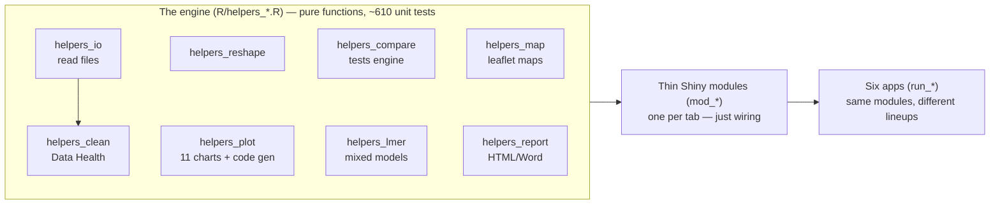
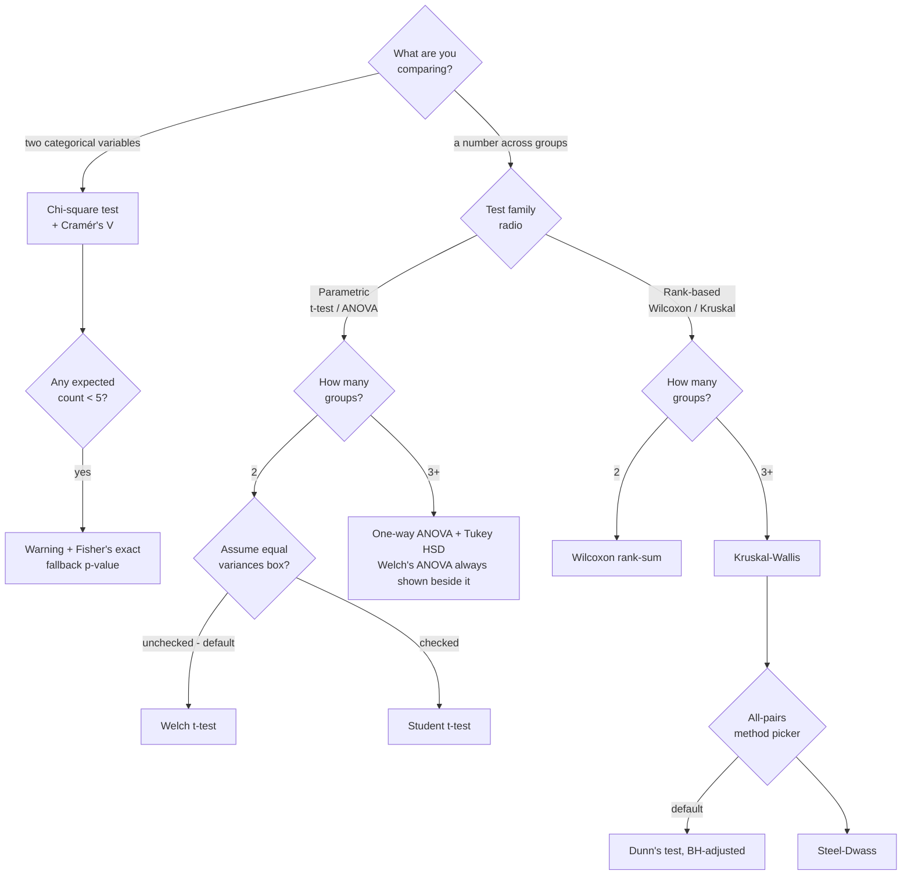
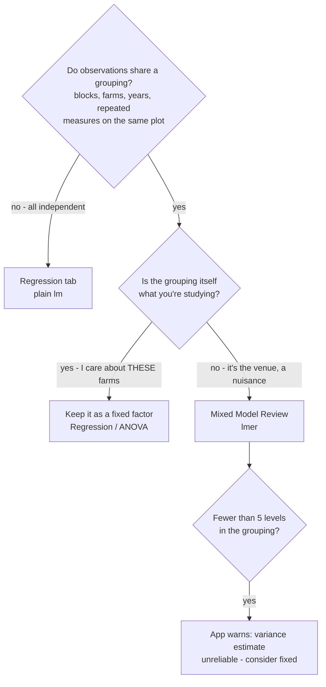
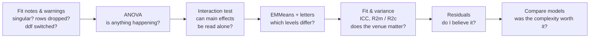
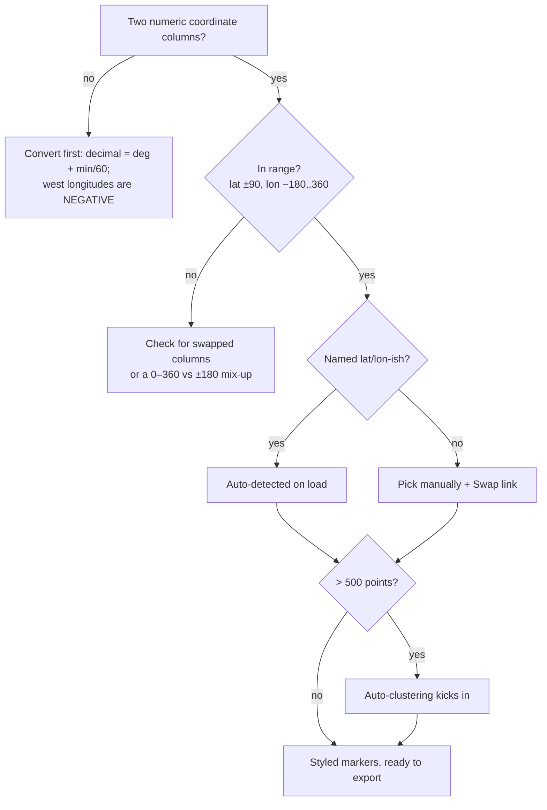
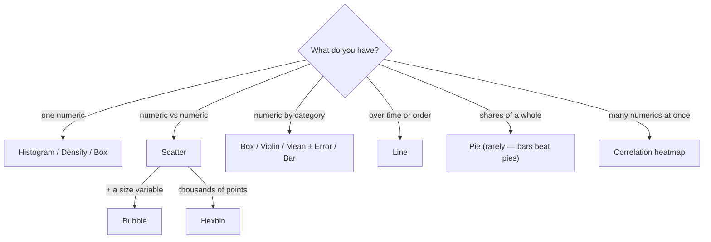

# foxplots — Know Your Own Package

*A presenter's crash course. Everything in here was checked against the actual source
code (v0.4.0). Personal study material — not shipped in the package or the coworker repo.*

---

## TL;DR crib card (memorize this screen)

**The elevator pitch:** "foxplots is a point-and-click toolkit for the full data
workflow — import, clean, reshape, summarize, visualize, map, test, and model — built as
six R Shiny apps on one tested engine. Every result can show you the exact R code that
produced it."

**The architecture sentence:** "All the logic lives in plain, unit-tested R functions
(~610 test checks); the app screens are thin wrappers around them. That's why I trust
the numbers."

**Decision rules:**
- Comparing a **number across groups** → Compare Groups. 2 groups → t-test (Welch by
  default); 3+ → ANOVA + Tukey. Data ugly (skewed, outliers)? → flip to rank-based
  (Wilcoxon / Kruskal-Wallis).
- **Two categorical variables** → Compare Groups, chi-square mode.
- **Blocks / farms / repeated measures in the design** → Mixed Model Review (lmer).
- **Predicting a number from others** → Regression.
- **Rows have lat/lon** → Map Tool.

**Numbers to hold:**
| Number | Meaning |
|---|---|
| **0.05** | The significance line (α) used everywhere |
| **0.2 / 0.5 / 0.8** | Cohen's d: small / medium / large |
| **0.01 / 0.06 / 0.14** | eta² (and epsilon²): small / medium / large |
| **0.1 / 0.3 / 0.5** | Rank-biserial r and Cramér's V: small / medium / large |
| **expected < 5** | Chi-square cells that trigger the Fisher's exact fallback |
| **< 5 levels** | A random effect this small gets a "consider fixed" warning |
| **12** | Max outcome × group combinations in grid testing |
| **1,000 rows** | Charts switch from interactive to static (speed) |
| **3×IQR** | Data Health's "extreme outlier" flag (flags, never deletes) |
| **±90 / −180..360** | Valid latitude / longitude; >500 points auto-cluster |

**The letters rule (say it exactly):** "Groups that share a letter could not be
statistically separated. **No letter in common = significantly different.**"

**The two humility lines:**
- "Statistical significance does not imply practical importance." (the app prints this)
- "That's outside what this tool fits — that's a consult with a statistician."

---

## How to use this guide

Three passes: **(1) Breadth** — read "The one picture" and the tab tour so you can
narrate any demo. **(2) Depth** — work the Compare Groups and Mixed Model deep dives;
each concept card ends with quotable answers. **(3) Retrieval** — drill the Q&A bank
cold, then re-read the crib card the morning of.

---

## 1. The one picture

**Why this matters on stage:** when anyone asks "where does that number come from?",
the answer is always the same — *a plain R function with unit tests; the screen is just
a wrapper, and the result tab will show you the exact R code it ran.* The six apps
(Data Explorer, Reshape, Combine, Compare Groups, Mixed Model Review, Map Tool) are
different line-ups of the same eleven modules.

**Data flows left to right** in the Data Explorer: Import → Reshape → *working data* →
everything downstream (Summarize, Visualize, Map, Compare, Regression, Export, Report).
Change the data upstream and every tab downstream sees the change.

---

## 2. Stats survival kit (three ideas that unlock everything)

### Card 1 — The p-value · *"how often would luck alone do this?"*
- **In one sentence:** the probability of seeing a difference at least this big *if the
  treatment truly did nothing* and only random noise were at work.
- **Field analogy:** two identical seed lots planted in a patchy field will still yield
  differently. The p-value asks: how often would field patchiness *alone* produce a gap
  this big? Small p = "patchiness rarely does this by itself."
- **In the app:** every test tab; verdicts turn green below **p < 0.05** and print
  "statistically significant."
- **The trap:** people think p is "the chance the result is wrong." It isn't — it
  assumes no effect and measures how surprising the data would be.
- **If someone asks:** "p = 0.03 means: if the treatment did nothing, I'd see a gap
  this big only about 3% of the time by luck. That's rare enough that we call it real —
  but the app also reminds you significance isn't the same as practical importance."

### Card 2 — Effect size · *"is it big enough to matter?"*
- **In one sentence:** how *large* the difference is, on a scale that doesn't grow just
  because you collected more data.
- **Field analogy:** with 400 plots, a 2 bu/ac gain can be "significant" and still not
  cover the fertilizer bill. p says *real*; effect size says *worth it*.
- **In the app:** every result card prints one, with a plain label (negligible / small /
  medium / large). Which one depends on the test:

| Test | Effect size | small / medium / large |
|---|---|---|
| t-test (2 groups) | Cohen's d — gap in units of natural spread | 0.2 / 0.5 / 0.8 |
| ANOVA (3+) | eta² — share of variation explained by group | 0.01 / 0.06 / 0.14 |
| Kruskal-Wallis | epsilon² — rank analogue of eta² | 0.01 / 0.06 / 0.14 |
| Wilcoxon (2) | rank-biserial r | 0.1 / 0.3 / 0.5 |
| Chi-square | Cramér's V — strength of association | 0.1 / 0.3 / 0.5 |

- **The trap:** reporting p without effect size — a tiny, useless difference can have a
  spectacular p-value if n is huge.
- **If someone asks:** "d = 0.8 means the groups are almost a full standard deviation
  apart — a gap you'd notice walking the field."

### Card 3 — Multiple testing & BH (`p_adj`) · *"twenty tests buy you a fluke"*
- **In one sentence:** run enough tests at 5% and something will come up "significant"
  by luck; adjustment raises the bar as the number of tests grows.
- **Field analogy:** scout 20 clean fields with a trap that false-alarms 5% of the time
  and you should *expect* one alarm. Benjamini-Hochberg (BH) tunes the alarms so your
  list of "finds" stays mostly true finds.
- **In the app:** grid testing (many outcomes × many groups) always shows a `p_adj`
  column, corrected **across the whole grid** — BH by default, Bonferroni/Holm/None
  selectable. Post-hoc tables have their own built-in control (Tukey, Dunn-BH,
  Steel-Dwass).
- **The trap:** `p_adj` isn't a different test — it's the same p-value, penalized for
  how many questions you asked at once. That's why it grows when you add outcomes.
- **If someone asks:** "The grid *is* the family of tests, so the correction runs
  across all combinations. A raw p of 0.03 can become p_adj 0.09 — meaning: within
  this many questions, that one is no longer distinguishable from luck."

---

## 3. The tab tour (one card per stop)

| Tab | What it does | Say this out loud |
|---|---|---|
| **About** | Explains the left-to-right workflow. | "Each tab feeds the next — what you import and reshape is what gets analyzed." |
| **Import + Data Health** | Reads CSV/TSV/TXT/Excel/RDS; auto-skips title/footnote lines; detects 9 fixable issues (bad names, whitespace, NA tokens like "N/A", numbers-stored-as-text, ISO dates, empty rows/cols, duplicates, extreme outliers); recasts column types; row filters. Every fix is opt-in and reversible ("Revert to original"). | "It finds the classic spreadsheet problems and fixes them with one click — reversibly. Outliers beyond 3×IQR get *flagged*, never deleted." |
| **Reshape** | JMP's Tables menu: Stack (wide→tall), Split (tall→wide), Transpose, Sort, Subset (incl. stratified sampling with a seed). "None" passes data through. | "This recreates JMP's Tables menu — Stack and Split are pivot_longer and pivot_wider under the hood." |
| **Combine** *(Combine Tool)* | Two-table ops: Concatenate (stack), Join (left/inner/full/right/cross by key), Update (overwrite or fill-blanks-only), Compare (which columns/cells differ). | "Anything that needs a *second* table lives here — the classic join-two-spreadsheets problem." |
| **Summarize** | Group stats (N, Mean, Median, Mode, Min, Max, SD, SE, IQR) or category **proportions with exact binomial confidence intervals**. | "Proportions come with exact Clopper-Pearson intervals, not the rough approximation." |
| **Visualize** | Up to 4 charts at once, 11 types, smart hints ("that X is categorical — try a box plot"), copy-ready ggplot2 code per chart. Interactive below 1,000 rows, static above (speed). | "Every chart has a copy button that gives you standalone ggplot2 code reproducing exactly what's on screen." |
| **Map** | Any table with lat/lon becomes an interactive map: auto-detected coordinates, color/size by variables with a legend, popups, clustering, HTML/PNG download + leaflet code. | "If your rows have coordinates, they're on a basemap in two clicks — and your pan/zoom survives every styling change." |
| **Compare Groups** | Do groups differ? t-test/ANOVA or rank-based, with assumption checks, effect sizes, post-hoc letters — or a whole grid of outcomes × groups with corrected p-values. | "It picks the right test from what you selected, checks the assumptions, and translates the result into a sentence." |
| **Regression** | Predict a number: linear, multiple, or polynomial `lm`, with R², overall significance, significant-predictor lists, and two diagnostic plots. | "Fitted-vs-actual should hug the diagonal; residuals should be a patternless band around zero." |
| **Mixed Model Review** | Field-trial modeling (lmerTest/emmeans): fixed treatments + random blocks, ANOVA, variance components, EMMeans with letters, diagnostics, model comparison. | "This is the tool for block designs and repeated measures — where plain ANOVA would pretend correlated plots are independent." |
| **Export** | Data (CSV/Excel/RDS), charts (PNG/PDF with size/DPI), summary CSV, model outputs. | "Everything you made leaves the app in the format your journal or advisor wants." |
| **Report + session save** | One click bundles the session into a self-contained HTML or an editable Word file (with optional "show the R code"); sections appear only for what you actually did. Save/restore captures the data-prep stage as a .rds. | "The report mirrors exactly what you did — nothing you didn't run shows up in it." |

---

## 4. Compare Groups — the deep dive

### D1 — Which test runs when (this mirrors the code exactly)

You never pick the specific test — you pick the *mode* (number-across-groups vs two
categoricals) and the *family* (parametric vs rank-based); the group count decides the
rest. The needed shape: **one row per observation**, a numeric outcome column, a
categorical group column. Requirements: ≥2 groups, ≥3 usable rows, every group ≥2
observations.

### Card 4 — Welch's correction · *"why the default t-test says 'Welch'"*
- **In one sentence:** a t-test that lets each group keep its own spread instead of
  pretending both spreads are equal.
- **Field analogy:** one field is irrigated (tight, uniform yields), the other dryland
  (all over the place). Student's t averages the two spreads as if equal; Welch doesn't.
- **In the app:** the 2-group default ("Assume equal variances" is unchecked). For 3+
  groups, **Welch's ANOVA is always computed alongside** classic ANOVA — and gets
  highlighted in red with "prefer this test" whenever the variance check fails.
- **The trap:** thinking Welch is a lesser or "corrected-after-the-fact" test. It costs
  almost nothing when variances *are* equal, which is exactly why it's the default.
- **If someone asks:** "Welch is just the safer t-test — it doesn't assume both groups
  are equally noisy. When they are, it agrees with Student's almost exactly."

### Card 5 — Parametric vs rank-based · *"weigh the pumpkins, or rank them"*
- **In one sentence:** parametric tests compare means of roughly bell-shaped data;
  rank tests convert values to ranks first, so skew and outliers can't dominate.
- **Field analogy:** judging pumpkins by exact weight vs by ribbon order. One
  hog-damaged plot can drag a *mean* badly; it can't drag a *rank* by more than one
  place.
- **In the app:** the "Test family" radio. Parametric → t-test/ANOVA; rank-based →
  Wilcoxon (2 groups) / Kruskal-Wallis (3+).
- **The trap:** "non-parametric" doesn't mean assumption-free — it still assumes
  independent observations and similar distribution shapes across groups.
- **If someone asks:** "When the assumption panel flags non-normal groups — especially
  with small samples — I flip this one switch and get the rank-based equivalent."

### Card 6 — Assumption checks · *"the soil test before you fertilize"*
- **In one sentence:** two quick pre-tests that tell you which main test to trust —
  they are not the result themselves.
- **In the app:** **Shapiro-Wilk** normality per group (skipped when a group has n < 3,
  n > 5000, or is constant) and **Levene's test** (the robust Brown-Forsythe version,
  centered on medians) for equal variances. Both flag at p < 0.05 with plain-English
  advice: non-normal → "prefer the non-parametric option"; unequal variances → "Welch
  handles this."
- **The trap:** a failed check doesn't invalidate your analysis — it *redirects* it.
  The app literally tells you which door to take.
- **If someone asks:** "The app runs the checks automatically and tells me what to do
  about a failure — that's the point of building the workflow in, instead of hoping
  people remember to check."

### Card 7 — Post-hoc tests & family-wise error · *"refereeing the whole tournament"*
- **In one sentence:** after an overall test says "*something* differs," post-hoc tests
  find *which pairs* differ — while controlling the error rate across all pairs at once.
- **Field analogy:** 3 varieties = 3 head-to-heads; 6 varieties = 15. That's 15 chances
  for a fluke ribbon; these methods referee the whole tournament at 5%, not each match.
- **In the app:**

| Path | Post-hoc | How it works (one line) |
|---|---|---|
| ANOVA (3+) | **Tukey HSD** | Compares means using the studentized-range distribution; family-wise control built in |
| Kruskal (3+), default | **Dunn's** | ONE joint ranking of all data (the same ranks Kruskal used), pairwise z-tests, then BH adjustment |
| Kruskal (3+), option | **Steel-Dwass** | Re-ranks **each pair on its own**, studentized-range control — the rank-world Tukey; what JMP calls "All Pairs, Steel-Dwass" |

- **The trap:** Dunn and Steel-Dwass can disagree — that's not a bug. An extreme third
  group compresses everyone's *joint* ranks (Dunn) but can't touch a *pairwise* ranking
  (Steel-Dwass). Different statistic, different penalty.
- **If someone asks:** "Dunn ranks everyone together once; Steel-Dwass ranks each pair
  fresh. We ship both because JMP does, and because they genuinely answer slightly
  different questions."

### Card 8 — Connecting letters (cld) · *"award tiers at the county fair"*
- **In one sentence:** a compact display of all pairwise results — groups sharing a
  letter could not be statistically separated.
- **In the app:** built from the **adjusted** pairwise p-values at 0.05, ordered by
  descending mean, and relabeled so letters always read a, b, c… down the table
  (highest mean = "a"). Appears for Tukey, Dunn, and Steel-Dwass — and again in the
  Mixed Model tool's EMMeans tab.
- **The trap:** sharing a letter is **not** proof of equality — it means "couldn't be
  separated with this data." And "a, ab, b" is legal: the middle group can't be told
  apart from either end even though the ends differ from each other.
- **If someone asks:** "One rule: **no letter in common = significantly different.**
  Everything else is 'not separable.'"

### Card 9 — Chi-square, expected counts & residuals · *"a fair deck of cards"*
- **In one sentence:** tests whether two categorical variables are associated, by
  comparing observed counts to the counts you'd expect if they were independent.
- **Field analogy:** expected counts are the table you'd get if variety and disease
  status were dealt out like a fair deck. Chi-square totals the surprise; the
  standardized residuals point at *which cell* is surprising (|z| > 2 ≈ a driver).
- **In the app:** chi-square mode gives the test, Cramér's V with a magnitude label,
  expected counts, standardized residuals, and optional row/column/total percentage
  tables. If any expected counts fall below 5, it warns you and prints a simulated
  **Fisher's exact** p-value (2,000 simulations) to rely on instead.
- **The trap:** a significant chi-square says the variables are *related*, not which
  category causes what — read the residuals and percentages for the story.
- **If someone asks:** "With small cells the chi-square approximation gets shaky, so
  the app automatically adds a Fisher's exact fallback and tells you to use that one."

### Grid testing (the "many at once" mode)
Pick several outcomes (max 6) and several grouping variables (max 4) — every
combination is tested (cap: 12), summarized one-row-per-combination with a **`p_adj`
column corrected across the entire grid** (BH default). Full write-ups live in closed
accordion panels underneath. **Why the cap and the correction matter:** the grid *is*
a family of tests; without correction, "test everything, report the survivors" is how
false discoveries get published.

**One more detail worth knowing:** the group-means table uses a **pooled** standard
error only on the classic-ANOVA path (that's JMP's "Means for Oneway Anova"); every
other path uses each group's own SD/√n.

---

## 5. Mixed Model Review — the deep dive

### D2 — When do I need it? (lm vs lmer)

### Card 10 — Fixed vs random effects · *"on trial vs the venue"* ⭐ the big one
- **In one sentence:** fixed effects are the treatments you chose on purpose and want
  a verdict on; random effects are the grouping you'd happily swap for another sample
  (blocks, farms, years) and only want to account for.
- **Field analogy:** Variety and Nitrogen rate are *on trial* — you picked those exact
  levels and want conclusions about them. The blocks are the *venue*: you don't care
  about "Block 3" specifically, and next year you'd use different ground.
- **In the app:** you assign each variable to the Fixed or Random picker. The model
  becomes `yield ~ Variety + Nitrogen + (1 | Block)` — that `(1 | Block)` term is the
  random effect.
- **The trap:** ignoring the grouping entirely (plain ANOVA) pretends plots in the same
  block are independent witnesses. They're not — they share soil, water, weather. That
  fake independence makes p-values overconfident.
- **If someone asks "why is Block random?":** "Because I want my conclusions to
  generalize beyond the particular blocks I happened to use. The model estimates *how
  much* blocks differ (a variance) rather than a separate number for each block, and it
  correctly handles the fact that plots within a block are correlated."
- **Numbers to hold:** the app requires ≥1 random effect (otherwise it points you to
  the Regression tab), caps fixed effects at 3, and warns when a grouping factor has
  <5 levels ("variance components estimated from fewer than ~5 levels are unreliable —
  consider modelling it as a fixed effect").

### Card 11 — REML vs ML · *"the grown-up n−1"*
- **In one sentence:** REML estimates the variance components honestly, after paying
  for the means it already estimated — the same idea as dividing by n−1 instead of n.
- **In the app:** REML is the default estimator; ML is a radio option. The **Compare
  models** tab automatically refits with ML when needed, because REML likelihoods
  can't be compared across different fixed effects (the app notes this itself).
- **The trap:** comparing two REML fits with different fixed effects — the numbers
  aren't on the same scale. The app protects you by refitting.
- **If someone asks:** "REML for estimating and reporting a model; ML only when
  comparing models with different fixed effects — and the tool switches for me."

### Card 12 — Kenward-Roger vs Satterthwaite · *"the honest witness count"*
- **In one sentence:** two ways of estimating how much independent evidence your
  F-tests really have, given that plots within a block aren't independent witnesses.
- **Field analogy:** 4 blocks × 6 plots is not 24 independent witnesses. Both methods
  compute a fair "effective" degrees-of-freedom; **Kenward-Roger** is the more careful
  accountant (it also adjusts the standard errors), **Satterthwaite** is the faster
  approximation.
- **In the app:** KR is the default when the pbkrtest package is installed; it
  *requires REML*, so if you pick ML the app auto-switches to Satterthwaite and tells
  you. They only meaningfully disagree in small trials — which is where careful matters.
- **If someone asks:** "For a decently sized trial they give nearly identical answers.
  I leave it on Kenward-Roger and let the app fall back when it must."

### Card 13 — Type III ANOVA + sum-to-zero contrasts · *"everyone already at the table"*
- **In one sentence:** Type III tests ask what each factor adds *given everything else
  is already in the model* — the fair question when the design is unbalanced.
- **In the app:** Type III is the default (Type II available). When interactions are ON
  and there are categorical fixed effects, the app silently applies sum-to-zero
  contrasts and notes it — without them, "main effect of Nitrogen" would secretly mean
  "at whichever Variety comes first alphabetically" instead of "averaged across
  varieties."
- **The trap:** Type III main effects are hard to interpret when the interaction is
  large — check the Interaction test tab before quoting main effects.
- **If someone asks:** "Sum-to-zero coding makes the main-effect tests mean 'averaged
  over the other factor's levels' — the app applies it exactly when it matters and
  prints a note saying so."

### Card 14 — Variance components & ICC · *"slicing the pie of variation"*
- **In one sentence:** the model splits total variation into "between groups" (e.g.
  block-to-block) and "within groups" (plot-to-plot); ICC is the between-groups share.
- **Field analogy:** high ICC = "two plots on the same farm look like twins; farms
  differ a lot." Low ICC = the venue barely matters.
- **In the app:** the Fit & variance tab shows the variance-components table
  (`VarCorr`), ICC, and a "caterpillar" plot of each block's estimated deviation.
- **If someone asks "what's a good ICC?":** "There isn't a universal cutoff — it's
  descriptive. What matters is that a non-trivial ICC *justifies the random effect*:
  the grouping really does structure the data."

### Card 15 — Marginal vs conditional R² · *"what travels to a new farm"*
- **In one sentence:** marginal R² = variance explained by the treatments alone;
  conditional R² = treatments *plus* knowing which block/farm each plot was in.
- **Field analogy:** marginal is what you can promise a grower on land you've never
  seen; the gap up to conditional is local knowledge.
- **In the app:** Fit & variance tab (computed via the performance package, with a
  MuMIn fallback). The app prints this exact gloss beside the numbers.
- **If someone asks "which do I report?":** "Both, labeled: 'treatments explain X%
  (marginal); with block information, Y% (conditional).'"

### Card 16 — EMMeans vs raw means · *"yields on a level playing field"*
- **In one sentence:** estimated marginal means are the model's predicted means with
  every other factor given equal weight — what each treatment *would have* averaged on
  a balanced trial.
- **Field analogy:** raw means still carry the accident of *where* each treatment
  landed; EMMeans level the playing field.
- **In the app:** the EMMeans & post-hoc tab: means with CIs, pairwise comparisons,
  connecting letters (same rule as Compare Groups), per-cell counts, and a note that
  averaging uses equal weights, not cell counts. A `by` factor gives "simple effects"
  (comparisons within each level, letters computed within each level).
- **The trap:** on unbalanced data EMMeans won't equal your spreadsheet averages —
  that's the feature, not a bug.
- **If someone asks:** "Raw means answer 'what happened in my plots'; EMMeans answer
  'what does the model say the treatment does, all else equal.' For unbalanced trials
  the second is the fair comparison."

### Card 17 — Transformations & back-transformation · *"judge in log, report in inches"*
- **In one sentence:** skewed or bounded responses get transformed so the model's
  assumptions hold, then the answers are converted back to the original scale.
- **In the app:** log (right-skewed, positive), log1p (skewed with zeros), sqrt
  (counts), inverse (rates), arcsine-sqrt (proportions 0–1) — each with a validation
  guard (e.g. log refuses non-positive responses). "Back-transform EMMeans" is on by
  default. The built-in RCBD example ships practice responses for three of them:
  `biomass_g` (log), `pest_count` (sqrt), and `germination` (arcsine-sqrt).
- **The trap:** after a log transform, back-transformed comparisons are **ratios**, not
  differences — "treatment A gives 20% more," not "+2 units." Tests still happen on the
  transformed scale.
- **If someone asks:** "The stats run where the assumptions hold; the report converts
  back so a grower can read it. The only price is that differences become ratios."

### Card 18 — Model comparison (LRT) · *"does the fancier model earn its keep?"*
- **In one sentence:** a likelihood-ratio test asks whether the extra terms in a bigger
  model improve fit more than chance would.
- **In the app:** "Save model for comparison," change something, run again, and the
  Compare models tab gives the LRT plus AIC/BIC — with guardrails: it warns if the
  responses/transforms differ (invalid comparison), if the two models used different
  rows, and it notes the boundary caveat when testing whether a variance component is
  zero (the ordinary chi-square is conservative there).
- **If someone asks:** "A significant LRT means the added term is worth its parameters.
  Lower AIC/BIC agrees. The models must be nested and fit on identical data — the app
  checks and warns."

### D3 — Reading a run (in this order)

**The built-in example (demo with this, always):** a seeded 3-factor RCBD — 6 Blocks ×
3 Varieties × 3 Nitrogen rates × 2 Irrigation = 108 plots, five response columns each
designed to teach something: `yield_kg` has a real Variety×Nitrogen interaction, `height_cm`
is purely additive, `biomass_g` wants a log transform, `germination` wants arcsine-sqrt,
`pest_count` wants sqrt. Note **Nitrogen arrives stored as a number** — recasting it to
a factor on the Import tab is itself a teaching moment.

---

## 6. The Map Tool

**What it is:** any table where each row has a latitude and longitude becomes an
interactive map — styled markers on a basemap, colored and sized by your variables,
with popups, a legend, clustering, downloads (interactive HTML, PNG), and copy-ready
leaflet code.

**What data it needs (the whole contract):**
- One row = one point. Two numeric columns in **decimal degrees** (29.6516, −82.3248) —
  not degrees-minutes-seconds, not "82.3 W" text, not UTM/State Plane.
- Valid ranges: latitude **−90..90**, longitude **−180..360** (the 0–360 Pacific
  convention is accepted — that's why the Fiji earthquakes demo works untouched).
- Columns named like `lat`/`latitude`/`decimallatitude`/`y` and
  `lon`/`lng`/`long`/`longitude`/`decimallongitude`/`x` are **auto-detected**
  (case-insensitive, range-checked); anything else you pick manually — there's a
  one-click swap if they land reversed.
- Rows with missing/out-of-range coordinates are dropped and **counted** ("Showing 214
  of 220 rows with usable coordinates").
- Everything else in the row is fair game for **color** (categories → distinct colors,
  numbers → gradient, legend always matches), **size** (numeric → area-proportional
  bubbles), **popups** (click), and **hover labels**.

### D5 — Is my file map-ready?

**Broad subjects? Yes — that's the design goal.** Anything observed *somewhere*:
research plots and trial sites, monitoring wells, weather stations, wildlife/insect
sightings, disease cases, soil samples, customer or facility locations, earthquakes,
storm reports. What it does **not** do (yet): shaded regions (choropleths), address
geocoding, or drawing shapes — points only, by deliberate v1 scoping.

**Worth knowing under questioning:** bubbles scale by **area** (square-root radius), so
twice the value reads as twice the ink — linear radius scaling is the classic lie-factor
mistake. Legends hide above 30 categories. Downloads: the HTML export is **one
self-contained file** that opens anywhere (the app inlines every script and style
itself — no pandoc, no zip); PNG snapshots run a headless Chrome — falling back to
**Microsoft Edge** automatically, so they work on standard UF machines. Basemap tiles
need internet. Since v0.5: a **log or quantile color scale** for skewed values, and
**"Group layers by"** any column (≤12 levels) for ArcGIS-style toggleable layers with
per-group clustering and a focus-zoom.

---

## 7. Which chart? (Visualize in 30 seconds)

The app nudges you itself (`chart_hint`): categorical X on a scatter → "try a box
plot"; continuous X on a bar → "a histogram is usually better"; >30 bar categories →
top 30 shown, rest lumped as "Other." Above 1,000 rows charts go static for speed
(exports always use all rows).

---

## 8. Finding real data to test with

| App | Needs (shape) | Good sources | Prep gotcha |
|---|---|---|---|
| **Map** | 1 row/point, decimal-degree lat+lon | **USGS Earthquake feed** (CSV, `latitude`/`longitude` — auto-detects as-is); **GBIF / eBird / iNaturalist** exports (`decimalLatitude`/`decimalLongitude` — also auto-detect); **USGS NWIS** water-monitoring sites; **Florida Geospatial Open Data Portal / FGDL** (export point layers as CSV); FDACS/FDOH open data | NOAA HURDAT2 storm tracks come as "28.0N 94.8W" text — convert to signed decimals first. **Anti-example:** USDA NASS Ag Census is county-level — no points; that's choropleth territory (roadmap) |
| **Compare Groups** | 1 row/observation; numeric outcome + categorical group | Built-ins first (iris, mtcars); the **`agridat`** R package — hundreds of real published ag trials, the single best source for this audience; any survey CSV for chi-square | Grid mode wants tidy long data — one measurement column per outcome |
| **Mixed Model** | Long format, 1 row/plot; treatment columns + a block/farm/rep column | The built-in RCBD example (always demo with it); **`agridat`** again — most entries are blocked designs ready to go; your unit's own trial spreadsheets | Treatments stored as numbers (like the example's Nitrogen) need recasting to factor |
| **Reshape / Combine / Visualize** | any tidy CSV | dplyr's `band_members`/`band_instruments` (the join demo), FL open-data portals, NASS QuickStats CSVs (great reshape practice — they arrive wide) | — |

---

## 9. Q&A drill (the questions you'll actually get)

**Compare Groups**

1. **Why did it use Welch's t-test instead of a regular t-test?** Welch doesn't assume
   both groups are equally noisy, costs almost nothing when they are, and is the safer
   default. Tick "Assume equal variances" if you specifically want Student's.
2. **What does `p_adj` mean and why is it bigger than my p-value?** It's the same
   p-value penalized for how many tests you ran at once; with 12 grid combinations, a
   raw 0.03 may no longer be distinguishable from luck.
3. **Why don't the letters match the raw p-values?** Letters are built from the
   *adjusted* pairwise p-values at 0.05 — the fair, corrected comparison.
4. **ANOVA significant but Tukey finds no pair different — how?** The overall F pools
   evidence across all groups; the pairwise correction is stricter. Real, and normal —
   report both honestly.
5. **When should I flip to rank-based?** Skewed data, outliers, or small samples that
   fail the normality check — the assumptions panel literally suggests it.
6. **Dunn's vs Steel-Dwass?** Dunn ranks all groups together once, then adjusts;
   Steel-Dwass re-ranks each pair alone with Tukey-style control — it's JMP's
   "All Pairs, Steel-Dwass."
7. **p = 0.049 — can I tell a grower it works?** It clears the conventional bar,
   barely. Check the effect size and the confidence interval before promising money —
   the app prints "significance does not imply practical importance" for a reason.
8. **Shapiro-Wilk failed — is my analysis invalid?** No — it's a signpost. Large
   samples fail Shapiro over trivial wobbles; small samples should switch to the
   rank-based family.
9. **"Expected counts < 5" on my chi-square — what now?** Use the Fisher's exact
   p-value the app automatically added below the chi-square result.

**Grid**

10. **Why did `p_adj` change when I added another outcome?** The grid is the family;
    the correction reruns across all combinations every time the grid changes.
11. **Can I test everything and report the survivors?** That's p-hacking. The grid
    allows the *search* but corrects the p-values so survivors are meaningful — and
    caps you at 12 combinations.

**Mixed Model**

12. **Why is Block random and Nitrogen fixed?** Nitrogen levels were chosen on purpose
    and are on trial; blocks are the venue — a sample of ground you'd swap next year,
    whose variation you account for rather than study.
13. **"Singular fit" — is the model broken?** A variance landed on zero — usually the
    data can't support the random structure. The app's own advisory lists the fixes:
    drop the random slope, remove a sparse factor, center/scale, or simplify.
14. **Kenward-Roger vs Satterthwaite — does it matter?** Only in small trials. KR is
    the careful default (needs REML — the app auto-switches and says so); both agree
    on decent-sized data.
15. **What is REML and why default?** The honest way to estimate variances (the n−1
    idea, grown up). ML is only needed when comparing different fixed effects — the
    Compare tab refits automatically.
16. **Why don't EMMeans match my spreadsheet averages?** Unbalanced data. EMMeans give
    every cell equal weight — the level-playing-field estimate; your raw average is
    weighted by whatever plot counts you happened to have.
17. **What's a good ICC?** No universal cutoff — it describes how much the grouping
    matters. A non-trivial ICC is the justification for the random effect.
18. **Marginal vs conditional R² — which to report?** Both, labeled: treatments alone
    (marginal) vs treatments plus knowing the block (conditional).
19. **Why won't it run without a random effect?** By design — with no grouping you
    don't need a mixed model; the app points you to the Regression tab (lm/aov).
20. **What does the Interaction test add beyond the ANOVA?** A focused test of whether
    the effect of one factor *changes* across another (differences-of-differences),
    plus the plot that shows it — non-parallel lines suggest, the F-test confirms.

**Map**

21. **Can it shade counties (choropleth)?** Not in v1 — points only, deliberately. It's
    top of the roadmap; today you can map county-level values as county-centroid points.
22. **My points are in the ocean.** Almost always a sign: west longitudes must be
    negative (−82, not 82) — or the columns are swapped; there's a one-click Swap link.
23. **Why did rows disappear from the map?** Missing or out-of-range coordinates are
    dropped, and the footer counts exactly how many.
24. **Can I use addresses instead of coordinates?** Not yet — no geocoding. Geocode
    outside (many county GIS portals do it), then import the lat/lon.

**General**

25. **Is this "real" statistics or simplified?** Real: it calls the same functions a
    statistician scripts — `t.test`, `aov`, `lmerTest::lmer`, `emmeans` — and every
    result tab exports the exact R code, so anything can be reproduced or audited.
26. **How does it compare to JMP — and didn't AI write it?** JMP's Tables menu and
    Fit-Y-by-X were the explicit design targets. It was built AI-assisted with the
    statistical engine unit-tested (~610 checks) against reference values, and the
    generated-code feature means nothing is a black box.

---

## 10. Recommended next additions (ranked)

1. **Choropleth / county maps.** The #1 gap for an extension audience: county-level
   data is everywhere (NASS, FDOH), point data isn't. Ship simplified county/state
   boundaries in the package, join by county name/FIPS, color by value. The map module
   was built with this in mind.
2. **Full app-state save/restore.** Session save currently captures the data-prep
   stage only; extending it to Visualize/Compare/Regression choices is already sketched
   in CLAUDE.md's "Possible next steps."
3. **GLMMs (counts & proportions).** The honest next step for the Mixed Model tool:
   `pest_count` and `germination` are currently handled by transformations; a
   `glmer` path (Poisson / binomial) is the modern treatment.
4. **shinyapps.io / Connect deployment.** Coworkers without R could use everything
   from a browser link; the apps are already written deployment-safe.
5. **Geocoding companion for the Map** (addresses → coordinates), plus GeoJSON/
   shapefile upload for custom regions — the natural Map v2 pair.

---

*Fact-checked against source v0.4.0 (helpers_compare.R, helpers_lmer.R, helpers_map.R,
helpers_clean.R and friends). If the app and this guide ever disagree, trust the app
and fix the guide.*
