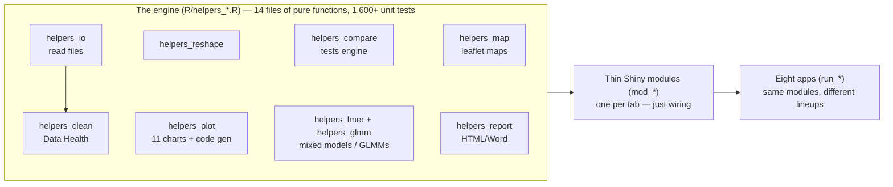
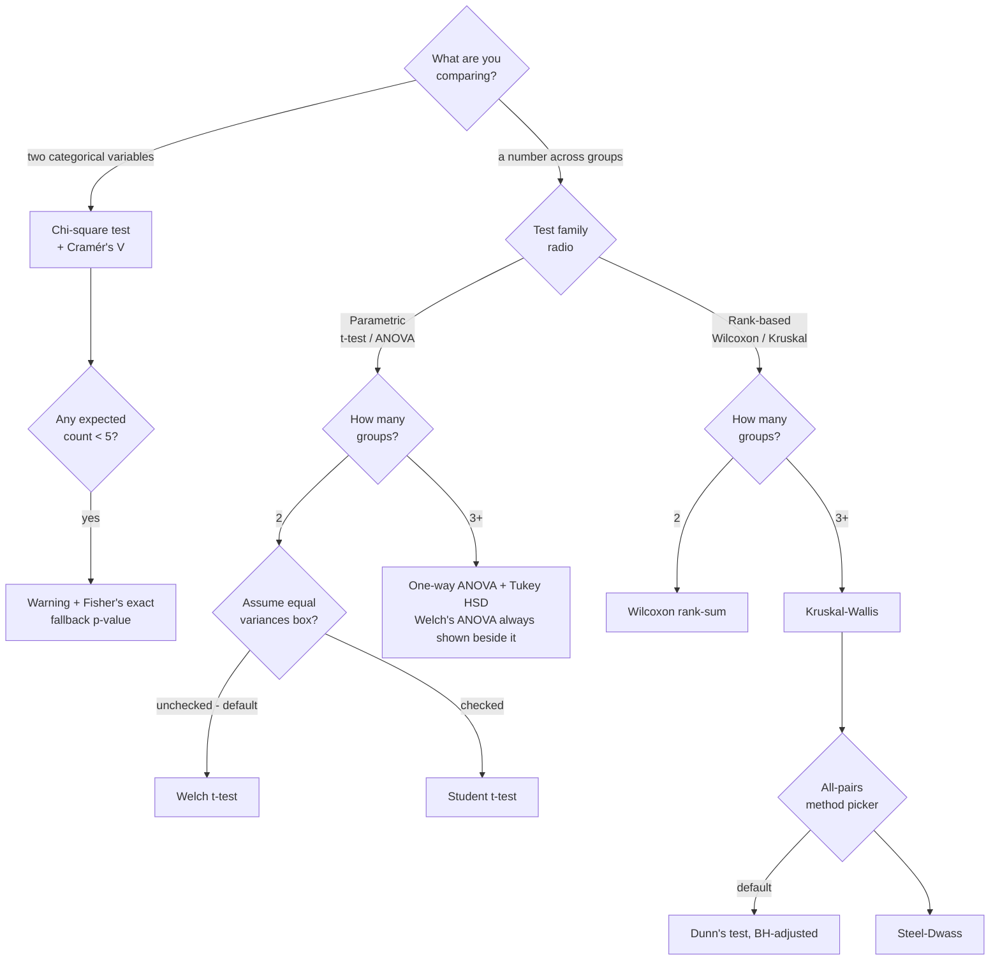
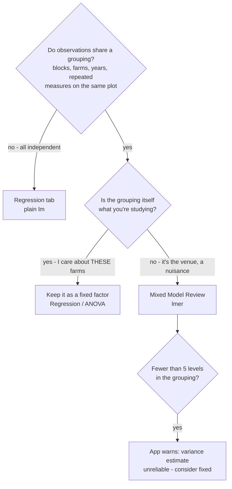
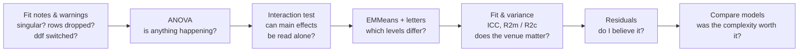
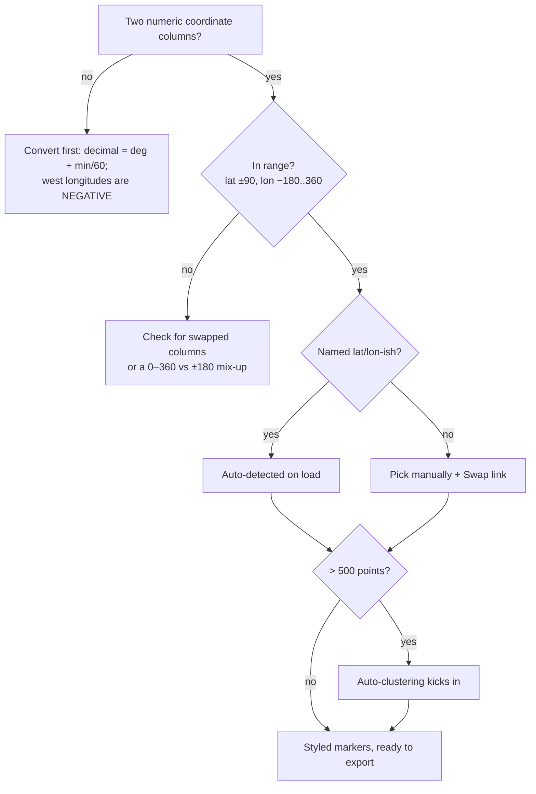
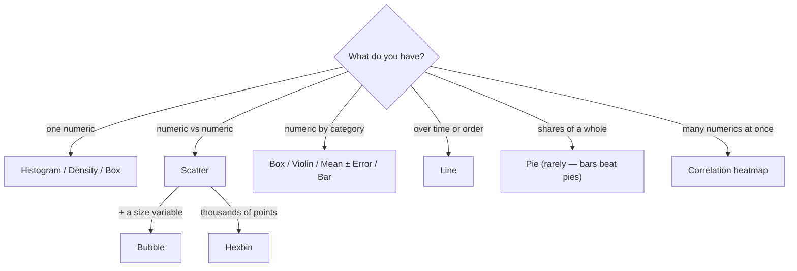

# foxplots — Know Your Own Package

*A presenter's crash course. Everything in here was checked against the actual source
code (v0.10.0). Personal study material — not shipped in the package or the coworker repo.*

---

## TL;DR crib card (memorize this screen)

**The elevator pitch:** "foxplots is a point-and-click toolkit for the full data
workflow — import, clean, reshape, summarize, visualize, map, test, and model — built as
eight R Shiny apps on one tested engine. Every result can show you the exact R code that
produced it."

**The architecture sentence:** "All the logic lives in plain, unit-tested R functions
(1,600+ test checks); the app screens are thin wrappers around them — and since v0.10.0
the wrappers are tested too. That's why I trust the numbers."

**Decision rules:**
- Comparing a **number across groups** → Compare Groups. 2 groups → t-test (Welch by
  default); 3+ → ANOVA + Tukey. Data ugly (skewed, outliers)? → flip to rank-based
  (Wilcoxon / Kruskal-Wallis).
- **Two categorical variables** → Compare Groups, chi-square mode.
- **Blocks / farms / repeated measures in the design**, response is a *number* →
  Mixed Model Review (lmer).
- **Counts, proportions, or presence/absence** — with or without blocks → **GLMM
  Review** (glmmTMB). Don't transform a count in the lmer tool; name the family.
- **Predicting a number from others** → Regression (linear; categorical predictors
  are fine — that's ANCOVA).
- **Predicting a yes/no** → Regression, Outcome type = Binary (logistic; read odds
  ratios, not R²).
- **Same test repeated within levels of a third variable** (mpg by cyl, split by am)
  → Compare Groups, "Split by".
- **Rows have lat/lon** → Map Tool (points / heatmap); **rows name regions** (states,
  counties, countries) → Map Tool, Shaded regions — **no coordinates and no boundary
  file needed**, they ship in the package.

**Numbers to hold:**
| Number | Meaning |
|---|---|
| **0.05** | The significance line (α) used everywhere |
| **0.2 / 0.5 / 0.8** | Cohen's d: small / medium / large |
| **0.01 / 0.06 / 0.14** | eta² (and epsilon²): small / medium / large |
| **0.1 / 0.3 / 0.5** | Rank-biserial r and Cramér's V: small / medium / large |
| **expected < 5** | Chi-square cells that trigger the Fisher's exact fallback |
| **< 5 levels** | A random effect this small gets a "consider fixed" warning |
| **24** | Max outcome × group combinations in grid testing |
| **1,000 rows** | Charts switch from interactive to static (speed) |
| **3×IQR** | Data Health's "extreme outlier" flag (flags, never deletes) |
| **±90 / −180..360** | Valid latitude / longitude; >500 points auto-cluster |
| **50** | Max distinct values you can colour a chart by (past it, colouring turns off) |
| **52 / 3,222 / 177** | Built-in boundaries: US states / US counties / world countries |
| **8 families** | GLMM Review's General tab (Poisson → nbinom2 → Beta → Tweedie …) |

**The letters rule (say it exactly):** "Groups that share a letter could not be
statistically separated. **No letter in common = significantly different.**"

**The two humility lines:**
- "Statistical significance does not imply practical importance." (the app prints this)
- "That's outside what this tool fits — that's a consult with a statistician."

---

## How to use this guide

Three passes: **(1) Breadth** — read "The one picture" and the tab tour so you can
narrate any demo. **(2) Depth** — work the Compare Groups and Mixed Model deep dives;
each concept card ends with quotable answers. **(3) Retrieval** — drill the Q&A bank
cold, then re-read the crib card the morning of.

---

## 1. The one picture

**Why this matters on stage:** when anyone asks "where does that number come from?",
the answer is always the same — *a plain R function with unit tests; the screen is just
a wrapper, and the result tab will show you the exact R code it ran.* The eight apps
(Data Explorer, Reshape, Combine, Compare Groups, Mixed Model Review, GLMM Review,
Map Tool, Regression Tool) are different line-ups of the same twelve modules.

**Data flows left to right** in the Data Explorer: Import → Reshape → *working data* →
everything downstream (Summarize, Visualize, Map, Compare, Regression, Export & Report).
Change the data upstream and every tab downstream sees the change.

---

## 2. Stats survival kit (three ideas that unlock everything)

### Card 1 — The p-value · *"how often would luck alone do this?"*
- **In one sentence:** the probability of seeing a difference at least this big *if the
  treatment truly did nothing* and only random noise were at work.
- **Field analogy:** two identical seed lots planted in a patchy field will still yield
  differently. The p-value asks: how often would field patchiness *alone* produce a gap
  this big? Small p = "patchiness rarely does this by itself."
- **In the app:** every test tab; verdicts turn green below **p < 0.05** and print
  "statistically significant."
- **The trap:** people think p is "the chance the result is wrong." It isn't — it
  assumes no effect and measures how surprising the data would be.
- **If someone asks:** "p = 0.03 means: if the treatment did nothing, I'd see a gap
  this big only about 3% of the time by luck. That's rare enough that we call it real —
  but the app also reminds you significance isn't the same as practical importance."

### Card 2 — Effect size · *"is it big enough to matter?"*
- **In one sentence:** how *large* the difference is, on a scale that doesn't grow just
  because you collected more data.
- **Field analogy:** with 400 plots, a 2 bu/ac gain can be "significant" and still not
  cover the fertilizer bill. p says *real*; effect size says *worth it*.
- **In the app:** every result card prints one, with a plain label (negligible / small /
  medium / large). Which one depends on the test:

| Test | Effect size | small / medium / large |
|---|---|---|
| t-test (2 groups) | Cohen's d — gap in units of natural spread | 0.2 / 0.5 / 0.8 |
| ANOVA (3+) | eta² — share of variation explained by group | 0.01 / 0.06 / 0.14 |
| Kruskal-Wallis | epsilon² — rank analogue of eta² | 0.01 / 0.06 / 0.14 |
| Wilcoxon (2) | rank-biserial r | 0.1 / 0.3 / 0.5 |
| Chi-square | Cramér's V — strength of association | 0.1 / 0.3 / 0.5 |

- **The trap:** reporting p without effect size — a tiny, useless difference can have a
  spectacular p-value if n is huge.
- **If someone asks:** "d = 0.8 means the groups are almost a full standard deviation
  apart — a gap you'd notice walking the field."

### Card 3 — Multiple testing & BH (`p_adj`) · *"twenty tests buy you a fluke"*
- **In one sentence:** run enough tests at 5% and something will come up "significant"
  by luck; adjustment raises the bar as the number of tests grows.
- **Field analogy:** scout 20 clean fields with a trap that false-alarms 5% of the time
  and you should *expect* one alarm. Benjamini-Hochberg (BH) tunes the alarms so your
  list of "finds" stays mostly true finds.
- **In the app:** grid testing (many outcomes × many groups) always shows a `p_adj`
  column, corrected **across the whole grid** — BH by default, Bonferroni/Holm/None
  selectable. Post-hoc tables have their own built-in control (Tukey, Dunn-BH,
  Steel-Dwass).
- **The trap:** `p_adj` isn't a different test — it's the same p-value, penalized for
  how many questions you asked at once. That's why it grows when you add outcomes.
- **If someone asks:** "The grid *is* the family of tests, so the correction runs
  across all combinations. A raw p of 0.03 can become p_adj 0.09 — meaning: within
  this many questions, that one is no longer distinguishable from luck."

---

## 3. The tab tour (one card per stop)

| Tab | What it does | Say this out loud |
|---|---|---|
| **About** | Explains the left-to-right workflow. | "Each tab feeds the next — what you import and reshape is what gets analyzed." |
| **Import + Data Health** | Reads CSV/TSV/TXT/Excel/RDS; auto-skips title/footnote lines; detects 9 fixable issues (bad names, whitespace, NA tokens like "N/A", numbers-stored-as-text, ISO dates, empty rows/cols, duplicates, extreme outliers); recasts column types; row filters. Every fix is opt-in and reversible ("Revert to original"). | "It finds the classic spreadsheet problems and fixes them with one click — reversibly. Outliers beyond 3×IQR get *flagged*, never deleted." |
| **Reshape** | JMP's Tables menu: Stack (wide→tall), Split (tall→wide), Transpose, Sort, Subset (incl. stratified sampling with a seed). "None" passes data through. | "This recreates JMP's Tables menu — Stack and Split are pivot_longer and pivot_wider under the hood." |
| **Combine** *(Combine Tool)* | Two-table ops: Concatenate (stack), Join (left/inner/full/right/cross by key), Update (overwrite or fill-blanks-only), Compare (which columns/cells differ). | "Anything that needs a *second* table lives here — the classic join-two-spreadsheets problem." |
| **Summarize** | Group stats (N, Mean, Median, Mode, Min, Max, SD, SE, IQR) or category **proportions with exact binomial confidence intervals**. | "Proportions come with exact Clopper-Pearson intervals, not the rough approximation." |
| **Visualize** | Up to 4 charts at once, 11 types, smart hints ("that X is categorical — try a box plot"), copy-ready ggplot2 code per chart. Interactive below 1,000 rows, static above (speed). | "Every chart has a copy button that gives you standalone ggplot2 code reproducing exactly what's on screen." |
| **Map** | Two map types. **Points**: auto-detected lat/lon, color AND size by variables (log/quantile scales for both, a graduated size legend), layer groups, popups, clustering, an optional density heatmap, a scale bar. **Shaded regions**: pick a **built-in** boundary set (US states / US counties / world countries) or upload your own GeoJSON, match a property to a data column, shade by mean/sum/median — with a loud report of which regions matched. **No latitude/longitude needed.** HTML/PNG download + leaflet code; the report includes a snapshot of exactly what you framed. | "If your rows have coordinates they're on a basemap in two clicks; if they just name counties, you get a shaded map with no coordinates and no file to find — and it tells you exactly which regions didn't match instead of going silently blank." |
| **Compare Groups** | Do groups differ? t-test/ANOVA or rank-based, with assumption checks, effect sizes, post-hoc letters — or a whole grid of outcomes × groups with corrected p-values, optionally **split by a third variable** (one analysis per stratum, BH across the whole family). | "It picks the right test from what you selected, checks the assumptions, and translates the result into a sentence. Split-by is JMP's By box: mpg by cyl within each transmission type." |
| **Regression** | Predict a number (linear `lm`) or a yes/no (logistic `glm`): numeric AND categorical predictors (pick each factor's reference level), interactions, polynomial fits. Coefficient table with 95% CIs, fit stats, EMMeans with letters, Q-Q / scale-location / Cook's diagnostics with an assumption panel (Shapiro, Breusch-Pagan, linearity, DW) and VIF, odds ratios for logistic, save-A/fit-B model comparison, copy-ready code. | "Fitted-vs-actual should hug the diagonal; residuals should be a patternless band. For logistic, read the odds ratios — an OR of 2 doubles the odds per unit. VIF above 5 means two predictors are telling me the same story." |
| **Mixed Model Review** | Field-trial modeling (lmerTest/emmeans): fixed treatments + random blocks, ANOVA, variance components, EMMeans with letters, diagnostics, model comparison. | "This is the tool for block designs and repeated measures — where plain ANOVA would pretend correlated plots are independent." |
| **GLMM Review** *(own app)* | The same block-design modelling for responses that were never normal: counts, proportions, presence/absence (glmmTMB). Two tabs — **General GLMM** (8 families, plus optional zero-inflation and dispersion side-models) and **Binary (0/1)**. DHARMa simulated-residual checks, Type III Wald ANOVA, EMMeans with letters on the response scale. | "The Mixed Model tool transforms a count and hopes; this one names the distribution. And it checks itself — DHARMa simulates from the fitted model and asks whether my real data looks like its own forecast." |
| **Export & Report** | One tab, two sub-tabs. *Data & downloads*: data (CSV/Excel/RDS), charts (PNG/PDF with size/DPI), summary CSV, model outputs. *Full report*: a self-contained HTML or editable Word file (with optional "show the R code") — **in all eight apps**, with a **per-section picker** so you choose what goes in. Save/restore captures the data-prep stage as a .rds. | "The report mirrors exactly what you did — and I can untick anything I don't want in it." |

---

## 4. Compare Groups — the deep dive

### D1 — Which test runs when (this mirrors the code exactly)

You never pick the specific test — you pick the *mode* (number-across-groups vs two
categoricals) and the *family* (parametric vs rank-based); the group count decides the
rest. The needed shape: **one row per observation**, a numeric outcome column, a
categorical group column. Requirements: ≥2 groups, ≥3 usable rows, every group ≥2
observations.

### Card 4 — Welch's correction · *"why the default t-test says 'Welch'"*
- **In one sentence:** a t-test that lets each group keep its own spread instead of
  pretending both spreads are equal.
- **Field analogy:** one field is irrigated (tight, uniform yields), the other dryland
  (all over the place). Student's t averages the two spreads as if equal; Welch doesn't.
- **In the app:** the 2-group default ("Assume equal variances" is unchecked). For 3+
  groups, **Welch's ANOVA is always computed alongside** classic ANOVA — and gets
  highlighted in red with "prefer this test" whenever the variance check fails.
- **The trap:** thinking Welch is a lesser or "corrected-after-the-fact" test. It costs
  almost nothing when variances *are* equal, which is exactly why it's the default.
- **If someone asks:** "Welch is just the safer t-test — it doesn't assume both groups
  are equally noisy. When they are, it agrees with Student's almost exactly."

### Card 5 — Parametric vs rank-based · *"weigh the pumpkins, or rank them"*
- **In one sentence:** parametric tests compare means of roughly bell-shaped data;
  rank tests convert values to ranks first, so skew and outliers can't dominate.
- **Field analogy:** judging pumpkins by exact weight vs by ribbon order. One
  hog-damaged plot can drag a *mean* badly; it can't drag a *rank* by more than one
  place.
- **In the app:** the "Test family" radio. Parametric → t-test/ANOVA; rank-based →
  Wilcoxon (2 groups) / Kruskal-Wallis (3+).
- **The trap:** "non-parametric" doesn't mean assumption-free — it still assumes
  independent observations and similar distribution shapes across groups.
- **If someone asks:** "When the assumption panel flags non-normal groups — especially
  with small samples — I flip this one switch and get the rank-based equivalent."

### Card 6 — Assumption checks · *"the soil test before you fertilize"*
- **In one sentence:** two quick pre-tests that tell you which main test to trust —
  they are not the result themselves.
- **In the app:** **Shapiro-Wilk** normality per group (skipped when a group has n < 3,
  n > 5000, or is constant) and **Levene's test** (the robust Brown-Forsythe version,
  centered on medians) for equal variances. Both flag at p < 0.05 with plain-English
  advice: non-normal → "prefer the non-parametric option"; unequal variances → "Welch
  handles this."
- **The trap:** a failed check doesn't invalidate your analysis — it *redirects* it.
  The app literally tells you which door to take.
- **If someone asks:** "The app runs the checks automatically and tells me what to do
  about a failure — that's the point of building the workflow in, instead of hoping
  people remember to check."

### Card 7 — Post-hoc tests & family-wise error · *"refereeing the whole tournament"*
- **In one sentence:** after an overall test says "*something* differs," post-hoc tests
  find *which pairs* differ — while controlling the error rate across all pairs at once.
- **Field analogy:** 3 varieties = 3 head-to-heads; 6 varieties = 15. That's 15 chances
  for a fluke ribbon; these methods referee the whole tournament at 5%, not each match.
- **In the app:**

| Path | Post-hoc | How it works (one line) |
|---|---|---|
| ANOVA (3+) | **Tukey HSD** | Compares means using the studentized-range distribution; family-wise control built in |
| Kruskal (3+), default | **Dunn's** | ONE joint ranking of all data (the same ranks Kruskal used), pairwise z-tests, then BH adjustment |
| Kruskal (3+), option | **Steel-Dwass** | Re-ranks **each pair on its own**, studentized-range control — the rank-world Tukey; what JMP calls "All Pairs, Steel-Dwass" |

- **The trap:** Dunn and Steel-Dwass can disagree — that's not a bug. An extreme third
  group compresses everyone's *joint* ranks (Dunn) but can't touch a *pairwise* ranking
  (Steel-Dwass). Different statistic, different penalty.
- **If someone asks:** "Dunn ranks everyone together once; Steel-Dwass ranks each pair
  fresh. We ship both because JMP does, and because they genuinely answer slightly
  different questions."

### Card 8 — Connecting letters (cld) · *"award tiers at the county fair"*
- **In one sentence:** a compact display of all pairwise results — groups sharing a
  letter could not be statistically separated.
- **In the app:** built from the **adjusted** pairwise p-values at 0.05, ordered by
  descending mean, and relabeled so letters always read a, b, c… down the table
  (highest mean = "a"). Appears for Tukey, Dunn, and Steel-Dwass — and again in the
  Mixed Model tool's EMMeans tab.
- **The trap:** sharing a letter is **not** proof of equality — it means "couldn't be
  separated with this data." And "a, ab, b" is legal: the middle group can't be told
  apart from either end even though the ends differ from each other.
- **If someone asks:** "One rule: **no letter in common = significantly different.**
  Everything else is 'not separable.'"

### Card 9 — Chi-square, expected counts & residuals · *"a fair deck of cards"*
- **In one sentence:** tests whether two categorical variables are associated, by
  comparing observed counts to the counts you'd expect if they were independent.
- **Field analogy:** expected counts are the table you'd get if variety and disease
  status were dealt out like a fair deck. Chi-square totals the surprise; the
  standardized residuals point at *which cell* is surprising (|z| > 2 ≈ a driver).
- **In the app:** chi-square mode gives the test, Cramér's V with a magnitude label,
  expected counts, standardized residuals, and optional row/column/total percentage
  tables. If any expected counts fall below 5, it warns you and prints a simulated
  **Fisher's exact** p-value (2,000 simulations) to rely on instead.
- **The trap:** a significant chi-square says the variables are *related*, not which
  category causes what — read the residuals and percentages for the story.
- **If someone asks:** "With small cells the chi-square approximation gets shaky, so
  the app automatically adds a Fisher's exact fallback and tells you to use that one."

### Grid testing (the "many at once" mode)
Pick several outcomes (max 6) and several grouping variables (max 4) — every
combination is tested (cap: 24), summarized one-row-per-combination with a **`p_adj`
column corrected across the entire grid** (BH default). Full write-ups live in closed
accordion panels underneath. **Why the cap and the correction matter:** the grid *is*
a family of tests; without correction, "test everything, report the survivors" is how
false discoveries get published.

**One more detail worth knowing:** the group-means table uses a **pooled** standard
error only on the classic-ANOVA path (that's JMP's "Means for Oneway Anova"); every
other path uses each group's own SD/√n.

---

## 5. Mixed Model Review — the deep dive

### D2 — When do I need it? (lm vs lmer)

### Card 10 — Fixed vs random effects · *"on trial vs the venue"* ⭐ the big one
- **In one sentence:** fixed effects are the treatments you chose on purpose and want
  a verdict on; random effects are the grouping you'd happily swap for another sample
  (blocks, farms, years) and only want to account for.
- **Field analogy:** Variety and Nitrogen rate are *on trial* — you picked those exact
  levels and want conclusions about them. The blocks are the *venue*: you don't care
  about "Block 3" specifically, and next year you'd use different ground.
- **In the app:** you assign each variable to the Fixed or Random picker. The model
  becomes `yield ~ Variety + Nitrogen + (1 | Block)` — that `(1 | Block)` term is the
  random effect.
- **The trap:** ignoring the grouping entirely (plain ANOVA) pretends plots in the same
  block are independent witnesses. They're not — they share soil, water, weather. That
  fake independence makes p-values overconfident.
- **If someone asks "why is Block random?":** "Because I want my conclusions to
  generalize beyond the particular blocks I happened to use. The model estimates *how
  much* blocks differ (a variance) rather than a separate number for each block, and it
  correctly handles the fact that plots within a block are correlated."
- **Numbers to hold:** the app requires ≥1 random effect (otherwise it points you to
  the Regression tab), caps fixed effects at 3, and warns when a grouping factor has
  <5 levels ("variance components estimated from fewer than ~5 levels are unreliable —
  consider modelling it as a fixed effect").

### Card 11 — REML vs ML · *"the grown-up n−1"*
- **In one sentence:** REML estimates the variance components honestly, after paying
  for the means it already estimated — the same idea as dividing by n−1 instead of n.
- **In the app:** REML is the default estimator; ML is a radio option. The **Compare
  models** tab automatically refits with ML when needed, because REML likelihoods
  can't be compared across different fixed effects (the app notes this itself).
- **The trap:** comparing two REML fits with different fixed effects — the numbers
  aren't on the same scale. The app protects you by refitting.
- **If someone asks:** "REML for estimating and reporting a model; ML only when
  comparing models with different fixed effects — and the tool switches for me."

### Card 12 — Kenward-Roger vs Satterthwaite · *"the honest witness count"*
- **In one sentence:** two ways of estimating how much independent evidence your
  F-tests really have, given that plots within a block aren't independent witnesses.
- **Field analogy:** 4 blocks × 6 plots is not 24 independent witnesses. Both methods
  compute a fair "effective" degrees-of-freedom; **Kenward-Roger** is the more careful
  accountant (it also adjusts the standard errors), **Satterthwaite** is the faster
  approximation.
- **In the app:** KR is the default when the pbkrtest package is installed; it
  *requires REML*, so if you pick ML the app auto-switches to Satterthwaite and tells
  you. They only meaningfully disagree in small trials — which is where careful matters.
- **If someone asks:** "For a decently sized trial they give nearly identical answers.
  I leave it on Kenward-Roger and let the app fall back when it must."

### Card 13 — Type III ANOVA + sum-to-zero contrasts · *"everyone already at the table"*
- **In one sentence:** Type III tests ask what each factor adds *given everything else
  is already in the model* — the fair question when the design is unbalanced.
- **In the app:** Type III is the default (Type II available). When interactions are ON
  and there are categorical fixed effects, the app silently applies sum-to-zero
  contrasts and notes it — without them, "main effect of Nitrogen" would secretly mean
  "at whichever Variety comes first alphabetically" instead of "averaged across
  varieties."
- **The trap:** Type III main effects are hard to interpret when the interaction is
  large — check the Interaction test tab before quoting main effects.
- **If someone asks:** "Sum-to-zero coding makes the main-effect tests mean 'averaged
  over the other factor's levels' — the app applies it exactly when it matters and
  prints a note saying so."

### Card 14 — Variance components & ICC · *"slicing the pie of variation"*
- **In one sentence:** the model splits total variation into "between groups" (e.g.
  block-to-block) and "within groups" (plot-to-plot); ICC is the between-groups share.
- **Field analogy:** high ICC = "two plots on the same farm look like twins; farms
  differ a lot." Low ICC = the venue barely matters.
- **In the app:** the Fit & variance tab shows the variance-components table
  (`VarCorr`), ICC, and a "caterpillar" plot of each block's estimated deviation.
- **If someone asks "what's a good ICC?":** "There isn't a universal cutoff — it's
  descriptive. What matters is that a non-trivial ICC *justifies the random effect*:
  the grouping really does structure the data."

### Card 15 — Marginal vs conditional R² · *"what travels to a new farm"*
- **In one sentence:** marginal R² = variance explained by the treatments alone;
  conditional R² = treatments *plus* knowing which block/farm each plot was in.
- **Field analogy:** marginal is what you can promise a grower on land you've never
  seen; the gap up to conditional is local knowledge.
- **In the app:** Fit & variance tab (computed via the performance package, with a
  MuMIn fallback). The app prints this exact gloss beside the numbers.
- **If someone asks "which do I report?":** "Both, labeled: 'treatments explain X%
  (marginal); with block information, Y% (conditional).'"

### Card 16 — EMMeans vs raw means · *"yields on a level playing field"*
- **In one sentence:** estimated marginal means are the model's predicted means with
  every other factor given equal weight — what each treatment *would have* averaged on
  a balanced trial.
- **Field analogy:** raw means still carry the accident of *where* each treatment
  landed; EMMeans level the playing field.
- **In the app:** the EMMeans & post-hoc tab: means with CIs, pairwise comparisons,
  connecting letters (same rule as Compare Groups), per-cell counts, and a note that
  averaging uses equal weights, not cell counts. A `by` factor gives "simple effects"
  (comparisons within each level, letters computed within each level).
- **The trap:** on unbalanced data EMMeans won't equal your spreadsheet averages —
  that's the feature, not a bug.
- **If someone asks:** "Raw means answer 'what happened in my plots'; EMMeans answer
  'what does the model say the treatment does, all else equal.' For unbalanced trials
  the second is the fair comparison."

### Card 17 — Transformations & back-transformation · *"judge in log, report in inches"*
- **In one sentence:** skewed or bounded responses get transformed so the model's
  assumptions hold, then the answers are converted back to the original scale.
- **In the app:** log (right-skewed, positive), log1p (skewed with zeros), sqrt
  (counts), inverse (rates), arcsine-sqrt (proportions 0–1) — each with a validation
  guard (e.g. log refuses non-positive responses). "Back-transform EMMeans" is on by
  default. The built-in RCBD example ships practice responses for three of them:
  `biomass_g` (log), `pest_count` (sqrt), and `germination` (arcsine-sqrt).
- **The trap:** after a log transform, back-transformed comparisons are **ratios**, not
  differences — "treatment A gives 20% more," not "+2 units." Tests still happen on the
  transformed scale.
- **If someone asks:** "The stats run where the assumptions hold; the report converts
  back so a grower can read it. The only price is that differences become ratios."

### Card 18 — Model comparison (LRT) · *"does the fancier model earn its keep?"*
- **In one sentence:** a likelihood-ratio test asks whether the extra terms in a bigger
  model improve fit more than chance would.
- **In the app:** "Save model for comparison," change something, run again, and the
  Compare models tab gives the LRT plus AIC/BIC — with guardrails: it warns if the
  responses/transforms differ (invalid comparison), if the two models used different
  rows, and it notes the boundary caveat when testing whether a variance component is
  zero (the ordinary chi-square is conservative there).
- **If someone asks:** "A significant LRT means the added term is worth its parameters.
  Lower AIC/BIC agrees. The models must be nested and fit on identical data — the app
  checks and warns."

### D3 — Reading a run (in this order)

**The built-in example (demo with this, always):** a seeded 3-factor RCBD — 6 Blocks ×
3 Varieties × 3 Nitrogen rates × 2 Irrigation = 108 plots, five response columns each
designed to teach something: `yield_kg` has a real Variety×Nitrogen interaction, `height_cm`
is purely additive, `biomass_g` wants a log transform, `germination` wants arcsine-sqrt,
`pest_count` wants sqrt. Note **Nitrogen arrives stored as a number** — recasting it to
a factor on the Import tab is itself a teaching moment.

---

## 6. The Map Tool

**What it is:** any table where each row has a latitude and longitude becomes an
interactive map — styled markers on a basemap, colored and sized by your variables,
with popups, a legend, clustering, downloads (interactive HTML, PNG), and copy-ready
leaflet code.

**What data it needs (the whole contract):**
- One row = one point. Two numeric columns in **decimal degrees** (29.6516, −82.3248) —
  not degrees-minutes-seconds, not "82.3 W" text, not UTM/State Plane.
- Valid ranges: latitude **−90..90**, longitude **−180..360** (the 0–360 Pacific
  convention is accepted — that's why the Fiji earthquakes demo works untouched).
- Columns named like `lat`/`latitude`/`decimallatitude`/`y` and
  `lon`/`lng`/`long`/`longitude`/`decimallongitude`/`x` are **auto-detected**
  (case-insensitive, range-checked); anything else you pick manually — there's a
  one-click swap if they land reversed.
- Rows with missing/out-of-range coordinates are dropped and **counted** ("Showing 214
  of 220 rows with usable coordinates").
- Everything else in the row is fair game for **color** (categories → distinct colors,
  numbers → gradient, legend always matches), **size** (numeric → area-proportional
  bubbles), **popups** (click), and **hover labels**.

### D5 — Is my file map-ready?

**Broad subjects? Yes — that's the design goal.** Anything observed *somewhere*:
research plots and trial sites, monitoring wells, weather stations, wildlife/insect
sightings, disease cases, soil samples, customer or facility locations, earthquakes,
storm reports. What it does **not** do (yet): address **geocoding**
(street addresses → coordinates) or drawing your own shapes. Shaded regions arrived in
v0.6.0 and stopped needing a downloaded boundary file in v0.9.0.

**Worth knowing under questioning:** bubbles scale by **area** (square-root radius), so
twice the value reads as twice the ink — linear radius scaling is the classic lie-factor
mistake. Legends hide above 30 categories. Downloads: the HTML export is **one
self-contained file** that opens anywhere (the app inlines every script and style
itself — no pandoc, no zip); PNG snapshots run a headless Chrome — falling back to
**Microsoft Edge** automatically, so they work on standard UF machines. Basemap tiles
need internet. Since v0.5: a **log or quantile color scale** for skewed values, and
**"Group layers by"** any column (≤12 levels) for ArcGIS-style toggleable layers with
per-group clustering and a focus-zoom.

---

## 7. Which chart? (Visualize in 30 seconds)

The app nudges you itself (`chart_hint`): categorical X on a scatter → "try a box
plot"; continuous X on a bar → "a histogram is usually better"; >30 bar categories →
top 30 shown, rest lumped as "Other." Above 1,000 rows charts go static for speed
(exports always use all rows).

---

## 8. Finding real data to test with

| App | Needs (shape) | Good sources | Prep gotcha |
|---|---|---|---|
| **Map** | 1 row/point, decimal-degree lat+lon | **USGS Earthquake feed** (CSV, `latitude`/`longitude` — auto-detects as-is); **GBIF / eBird / iNaturalist** exports (`decimalLatitude`/`decimalLongitude` — also auto-detect); **USGS NWIS** water-monitoring sites; **Florida Geospatial Open Data Portal / FGDL** (export point layers as CSV); FDACS/FDOH open data | NOAA HURDAT2 storm tracks come as "28.0N 94.8W" text — convert to signed decimals first. **Once an anti-example, now a headline case:** USDA NASS Ag Census is county-level with no points — that is exactly what Shaded regions is for. Join on county name (set "Limit to state") or on 5-digit FIPS, which never collides |
| **Compare Groups** | 1 row/observation; numeric outcome + categorical group | Built-ins first (iris, mtcars); the **`agridat`** R package — hundreds of real published ag trials, the single best source for this audience; any survey CSV for chi-square | Grid mode wants tidy long data — one measurement column per outcome |
| **Mixed Model** | Long format, 1 row/plot; treatment columns + a block/farm/rep column | The built-in RCBD example (always demo with it); **`agridat`** again — most entries are blocked designs ready to go; your unit's own trial spreadsheets | Treatments stored as numbers (like the example's Nitrogen) need recasting to factor |
| **Reshape / Combine / Visualize** | any tidy CSV | dplyr's `band_members`/`band_instruments` (the join demo), FL open-data portals, NASS QuickStats CSVs (great reshape practice — they arrive wide) | — |

---

## 9. Q&A drill (the questions you'll actually get)

**Compare Groups**

1. **Why did it use Welch's t-test instead of a regular t-test?** Welch doesn't assume
   both groups are equally noisy, costs almost nothing when they are, and is the safer
   default. Tick "Assume equal variances" if you specifically want Student's.
2. **What does `p_adj` mean and why is it bigger than my p-value?** It's the same
   p-value penalized for how many tests you ran at once; with 24 grid combinations, a
   raw 0.03 may no longer be distinguishable from luck.
3. **Why don't the letters match the raw p-values?** Letters are built from the
   *adjusted* pairwise p-values at 0.05 — the fair, corrected comparison.
4. **ANOVA significant but Tukey finds no pair different — how?** The overall F pools
   evidence across all groups; the pairwise correction is stricter. Real, and normal —
   report both honestly.
5. **When should I flip to rank-based?** Skewed data, outliers, or small samples that
   fail the normality check — the assumptions panel literally suggests it.
6. **Dunn's vs Steel-Dwass?** Dunn ranks all groups together once, then adjusts;
   Steel-Dwass re-ranks each pair alone with Tukey-style control — it's JMP's
   "All Pairs, Steel-Dwass."
7. **p = 0.049 — can I tell a grower it works?** It clears the conventional bar,
   barely. Check the effect size and the confidence interval before promising money —
   the app prints "significance does not imply practical importance" for a reason.
8. **Shapiro-Wilk failed — is my analysis invalid?** No — it's a signpost. Large
   samples fail Shapiro over trivial wobbles; small samples should switch to the
   rank-based family.
9. **"Expected counts < 5" on my chi-square — what now?** Use the Fisher's exact
   p-value the app automatically added below the chi-square result.

**Grid**

10. **Why did `p_adj` change when I added another outcome?** The grid is the family;
    the correction reruns across all combinations every time the grid changes.
11. **Can I test everything and report the survivors?** That's p-hacking. The grid
    allows the *search* but corrects the p-values so survivors are meaningful — and
    caps you at 24 combinations.

**Mixed Model**

12. **Why is Block random and Nitrogen fixed?** Nitrogen levels were chosen on purpose
    and are on trial; blocks are the venue — a sample of ground you'd swap next year,
    whose variation you account for rather than study.
13. **"Singular fit" — is the model broken?** A variance landed on zero — usually the
    data can't support the random structure. The app's own advisory lists the fixes:
    drop the random slope, remove a sparse factor, center/scale, or simplify.
14. **Kenward-Roger vs Satterthwaite — does it matter?** Only in small trials. KR is
    the careful default (needs REML — the app auto-switches and says so); both agree
    on decent-sized data.
15. **What is REML and why default?** The honest way to estimate variances (the n−1
    idea, grown up). ML is only needed when comparing different fixed effects — the
    Compare tab refits automatically.
16. **Why don't EMMeans match my spreadsheet averages?** Unbalanced data. EMMeans give
    every cell equal weight — the level-playing-field estimate; your raw average is
    weighted by whatever plot counts you happened to have.
17. **What's a good ICC?** No universal cutoff — it describes how much the grouping
    matters. A non-trivial ICC is the justification for the random effect.
18. **Marginal vs conditional R² — which to report?** Both, labeled: treatments alone
    (marginal) vs treatments plus knowing the block (conditional).
19. **Why won't it run without a random effect?** By design — with no grouping you
    don't need a mixed model; the app points you to the Regression tab (lm/aov).
20. **What does the Interaction test add beyond the ANOVA?** A focused test of whether
    the effect of one factor *changes* across another (differences-of-differences),
    plus the plot that shows it — non-parallel lines suggest, the F-test confirms.

**Map**

21. **Can it shade counties (choropleth)?** Yes — and the boundaries ship inside the
    package, so there is no file to hunt for and **no coordinates needed**. Map type →
    Shaded regions → Boundaries: **US counties** → "Limit to state" if you want one
    state → match your county column → shade by a number. If it comes out blank, read
    the match report: the join is an exact text match and it names the strays.
22. **My points are in the ocean.** Almost always a sign: west longitudes must be
    negative (−82, not 82) — or the columns are swapped; there's a one-click Swap link.
23. **Why did rows disappear from the map?** Missing or out-of-range coordinates are
    dropped, and the footer counts exactly how many.
24. **Can I use addresses instead of coordinates?** Not yet — no geocoding. Geocode
    outside (many county GIS portals do it), then import the lat/lon.

**General**

25. **Is this "real" statistics or simplified?** Real: it calls the same functions a
    statistician scripts — `t.test`, `aov`, `lmerTest::lmer`, `emmeans` — and every
    result tab exports the exact R code, so anything can be reproduced or audited.
26. **How does it compare to JMP — and didn't AI write it?** JMP's Tables menu and
    Fit-Y-by-X were the explicit design targets. It was built AI-assisted with the
    statistical engine unit-tested (1,600+ checks) against reference values, and the
    generated-code feature means nothing is a black box.

---

## 10. Recommended next additions (ranked)

*Two of the original five shipped. Kept here — with what actually happened — because
"what's next" is a question you will be asked, and "we built it" is the best answer.*

- ~~**Choropleth / county maps.**~~ **DONE.** The choropleth path shipped in v0.6.0
  (GeoJSON upload); v0.9.0 put the boundaries *inside the package* — US states,
  US counties, world countries — joinable by name, abbreviation or FIPS. Exactly the
  NASS/FDOH case this item was written for.
- ~~**GLMMs (counts & proportions).**~~ **DONE, and bigger than proposed.** v0.7.0
  shipped a whole eighth app, GLMM Review — `glmmTMB` rather than `glmer`, eight
  families, zero-inflation and dispersion side-models, DHARMa checks. Contributed by
  a collaborator and absorbed to the house pattern.

**Still open, in order:**

1. **Full app-state save/restore.** Session save still captures the **data-prep stage
   only** (working data, filters, reshape settings). Extending it to the Visualize /
   Compare / Regression choices is sketched in CLAUDE.md's "Possible next steps" — the
   plumbing (a shared `session_store`) already exists; each analysis module would
   publish its inputs to it the way `mod_reshape` does.
2. **CRAN.** The package has been `R CMD check --as-cran` clean for three releases
   (only environmental NOTEs). Remaining work is an `@examples` pass and the
   submission mechanics. *Deliberately paused, not blocked.*
3. **shinyapps.io / Connect deployment.** Coworkers without R could use everything
   from a browser link; the apps are already written deployment-safe (`system.file()`
   paths, inlined logo, thin `inst/apps/<name>/app.R` entries).
4. **Geocoding companion for the Map** (addresses → coordinates). The only part of the
   original item 5 still missing — the boundary half went further than proposed.
5. **A row-count guard on import.** There is no cap or warning today: an 11k-row file
   is comfortable, a multi-million-row one will be slow everywhere. Known gap.

---

## Addendum — what changed in v0.6.0 (know these cold)

**The three new concept cards:**

### Card A1 — Odds ratio · *"per unit, how much do the odds multiply?"*
Logistic regression models the **probability of the second level** of a binary
outcome. Each coefficient exponentiates into an **odds ratio**: OR = 2 means one
unit more of that predictor **doubles the odds** of the outcome; OR = 0.5 halves
them; OR = 1 is no effect. The 95% CI matters the same way it does everywhere —
**if it crosses 1, you can't call the effect**. Say: "Odds, not probability — a
doubled odds is not a doubled risk unless the outcome is rare."
*In the app:* Regression → Outcome type: Binary → the Odds ratios card names the
level being modelled.

### Card A2 — VIF · *"are two predictors telling me the same story?"*
Variance Inflation Factor = how much a predictor's variance is inflated because
the OTHER predictors can already predict it. **VIF > 5 = moderate concern, > 10 =
high** — the model can't tell those predictors apart (unstable coefficients,
weird signs). Fix: drop one of the pair, or combine them. Say: "The model is
fine for *prediction*; it's the individual coefficients you can't trust."
*In the app:* Regression → Diagnostics → the VIF table (hand-computed, matches
`car::vif` exactly).

### Card A3 — McFadden pseudo-R² · *"logistic's R², on a different scale"*
For logistic models there is no variance to explain, so R² is replaced by
McFadden's **1 − deviance/null-deviance**. The scale is different: **0.2–0.4
already indicates a good fit** — do NOT read it like a linear R². The overall
test is a likelihood-ratio test against the intercept-only model.
*In the app:* Regression → Fit statistics ("McFadden R-sq") + the
interpretation card wording.

**New capabilities to demo (30-second scripts):**
- **Split-by (Compare Groups):** load mtcars → outcome `mpg`, group `cyl`,
  Split by `am` → two ANOVAs, one per transmission, Stratum column, BH across
  both. "This is JMP's By box."
- **Regression with a factor:** Import → Change Type `cyl` → factor → Regression
  → predictors `wt` + `cyl` → the reference-level picker appears; Estimated
  means tab gives the letters. "ANCOVA without writing a formula."
- **Logistic:** Regression Tool → mtcars → Outcome type Binary → response `am`,
  predictors `wt` + `hp` → odds ratios card. "The one model lmer can't do."
- **Map size scales + legend:** size by a skewed column → flip Linear → Log —
  "now the small bubbles stop lying," and the bottom-left key decodes them.
- **Choropleth:** Map → Shaded regions → upload a county GeoJSON → match NAME to
  your county column → shade by yield. If the map is blank, **read the match
  report** — it names every region that didn't join.
- **Report:** the map now lands IN the HTML/Word report, framed exactly as on
  screen.

**Crib updates (as of v0.6.0 - superseded by the v0.10.0 addendum below):** seven
apps; ~940 checks; the Map has two modes; Regression is
linear + logistic; split-by caps at 6 strata; choropleth caps at 3,000 regions.

---

---

## Addendum — what changed in v0.7.0 → v0.10.0 (the eighth app, and four fixes worth knowing)

*Four releases in one addendum. The big one is **GLMM Review**, a whole new statistical
area — if someone asks about counts or proportions, this is where you go.*

### The one-line version of each release
- **v0.7.0** — an eighth app, **GLMM Review** (glmmTMB), contributed by a collaborator.
- **v0.8.0** — a 10-item field-testing punch list: the combination cap to 24, SEs on the
  connecting letters, combine-points-by-area on the map, Export and Report merged.
- **v0.9.0** — **built-in map boundaries**, and a report in **every** app with a picker.
- **v0.10.0** — the colour-by freeze fixed, the map settings made usable, and the first
  automated tests for the app layer itself.

---

## G. GLMM Review — the new deep dive

### Card G1 — What a GLMM is · *"same block design, different kind of measurement"*
A mixed model (fixed treatments + random blocks, exactly Card 10) for a response that is
**not** a bell curve — counts, proportions, presence/absence — made workable by naming
the **family** (what kind of number it is) and the **link** (the scale the arithmetic
happens on).
*Field analogy:* `lmer` assumes yield could in principle be any number, spread
symmetrically. Insect counts can't: they're whole numbers, they stop dead at zero, and
the busy traps are also the noisiest. A GLMM keeps the block structure and swaps the
assumption about the measurement.
*Say this:* "Same design, honest distribution. The old move was to log-transform a count
and hope; this names what the number actually is."
*In the app:* the **GLMM Review** app → **General GLMM** tab.

### Card G2 — The link · *"model in log, report in bugs"*
The scale the model does its straight-line arithmetic on. The link converts back so a
prediction can never leave the legal range: counts can't go negative, but a straight line
can. On a log link, "Fertilized adds 0.6" means **multiplies counts by e⁰·⁶ ≈ 1.8** — and
a multiplier can shrink toward zero forever without crossing it.
*Say this:* "Coefficients are on the link scale, so differences become **ratios**. The
marginal means tab hands them back on the response scale."
*In the app:* every family names its link — *"Poisson (log link) – counts"*.

### Card G3 — Overdispersion · *"the Poisson's one and only promise"* ⭐
Poisson assumes **variance = mean**. Real field counts clump, so the variance is bigger —
and a model that won't allow it reports standard errors that are too small and p-values
that are too exciting.
*Field analogy:* insects arrive in flushes, so some traps sit empty and others are
loaded. Poisson budgets for "randomly scattered"; the negative binomial budgets for
"clumped."
*Say this:* "Overdispersion doesn't bias the estimates much — it lies about the
**uncertainty**. That's why it manufactures significance."
*In the app:* **DHARMa residuals** tab flags it; the fix is Family → **negative binomial
(nbinom2)**. nbinom1 is the alternative shape (variance grows proportionally rather than
quadratically).

### Card G4 — Zero-inflation · *"two different reasons for a zero"*
Some zeros mean *the process ran and produced nothing*; others mean *the process was
never there*. Zero-inflation fits the second kind separately — a probability of a
structural zero sitting on top of the ordinary count model.
*Field analogy:* a quadrat with no seedlings might be poor ground that had a bad year (a
sampling zero) or scraped ground with no seed bank at all (a structural zero). Pool them
and the count model concludes the whole field is dead.
*In the app:* **Advanced model options** → **"Zero-inflation model (ziformula)"**. Blank
means intercept-only ("a constant share of structural zeros"); naming predictors lets the
*chance* of a structural zero depend on them.
*Demo response:* `seedling_count` in the example data is built zero-heavy for this.

### Card G5 — Beta and Tweedie · *"proportions, and rainfall"*
- **Beta (logit link)** — a proportion measured in its own right: percent cover, moisture
  fraction, share of a leaf diseased. Strictly **between** 0 and 1, with **no denominator
  to count**. Its variance naturally shrinks near both ends, which a normal model has no
  concept of. *(If you DO have a denominator — 7 of 20 plants — that's binomial, not
  Beta.)*
- **Tweedie (log link)** — non-negative **continuous** data with a real pile of exact
  zeros: rainfall, biomass with true absences. The near neighbour, **Gamma**, refuses
  zeros outright, which is the usual reason a Gamma fit errors.
*In the app:* `cover_prop` in the example data is the Beta demo (clamped strictly inside
(0,1) on purpose).

### Card G6 — DHARMa simulated residuals · *"where does each plot fall in its own forecast?"* ⭐
You can't eyeball raw residuals from a count model — they're not supposed to be normal.
DHARMa instead simulates hundreds of possible outcomes for **every row**, then asks what
fraction fall below what you actually observed. If the model is right, those fractions are
spread **uniformly between 0 and 1** — whatever family you picked.
*Field analogy:* the model is a machine for generating plausible fields. Run it a thousand
times; each real plot should land in an unremarkable spot in its own pile. If real plots
keep landing at the extremes, the machine is wrong.
*Say this:* "It turns 'are these residuals OK?' into one question with the same answer
shape for every family: **is this uniform?**"
*In the app:* the **DHARMa residuals** tab — a QQ plot that should sit on the diagonal, a
predicted-vs-residual panel, and printed tests for **uniformity, dispersion, outliers and
zero-inflation**. Check it *before* you read the ANOVA.

### Card G7 — The Binary (0/1) tab · *"presence/absence gets its own room"*
A separate tab for a 0/1 or two-level response. The family is fixed (Bernoulli); the only
distributional choice left is the **link** — logit (default, coefficients are log-odds),
probit, cloglog (asymmetric, useful when 1s are rare), cauchit.
*Why separate:* 0/1 data has **no free dispersion parameter**, so a shared code path would
have to silently ignore half the controls. Keeping it apart avoids the "it did something
odd with my 0/1 column" failure mode.
*Say this:* "It tells me on screen which level it's modelling — `Modeling P(present = "1")`
— so I'm never guessing which direction the odds run."

### Card G8 — Wald Type III ANOVA · *"chi-square where you expected an F"*
The omnibus "does this term matter" test for a glmmTMB fit is a **Wald chi-square** per
term, Type III (each tested with everything else already in the model). There's no F
because there's no residual variance to form one from.
*In the app:* the **Wald ANOVA** tab. It uses the optional `car` package — without it the
tab prints an instructive note instead of erroring.

### Card G9 — Which modelling tool do I open? · *the three doors* ⭐
- **Numbers, rows independent** → **Regression Tool** (`lm`); yes/no → Outcome type Binary (`glm`).
- **Numbers, rows share blocks / farms / years / repeated measures** → **Mixed Model Review** (`lmerTest`).
- **Counts, proportions, presence/absence** — with or without a grouping → **GLMM Review** (`glmmTMB`).
*The tools enforce it themselves:* the Mixed Model tool refuses to run without a random
effect; the GLMM tool runs happily without one and tells you it fitted a plain GLM.

---

## M. Map — three things that changed

### Card M1 — Built-in boundaries · *"a column of county names is enough"* ⭐
Shaded maps no longer need a downloaded file. **US states (52), US counties (3,222), world
countries (177)** ship inside the package. You need **one column of names and one number** —
no latitude, no longitude, no download.
*In the app:* Map type → Shaded regions → **Boundaries**. "Limit to state" narrows counties
(Florida = 67 polygons instead of 3,222). If your data has no coordinates at all, the Map
tab **says so** and points you here.

### Card M2 — The choropleth join is a spreadsheet lookup · *"blank map = failed join"*
The shading is an **exact text match** between the boundary's name property and your
column. `"FL"` will not match `"Florida"`; `"ALACHUA"` will not match `"Alachua"`.
Unmatched regions draw pale grey.
*Say this:* "A blank map is almost never a bug — it's a join that found nothing, and the
sidebar names the strays on both sides."
*In the app:* **"Region name property"** shows an example of each option
(`county_state — e.g. Brooks County, Georgia`) so you can eyeball which one matches your
column. **FIPS never collides** — use it when names are messy.

### Card M3 — Three ways to stop drawing 11,000 dots
| Control | What it actually does |
|---|---|
| **Cluster nearby points** | Purely **cosmetic**. Nearby markers collapse into a numbered bubble that splits as you zoom. No arithmetic. Auto switches on above **500** points. |
| **Combine points by area** | Real **aggregation**: one bubble per area at the centroid of its points, sized by how many it combined. Needs 2–100 distinct areas. |
| **Shaded regions** | A different map entirely: no points at all, regions shaded by a summary. |
Since v0.10.0 the **density heatmap composes with "Combine points by area"** — the heat
surface is built from the raw points, so you get density underneath and per-area counts on
top. Untick "Show point markers" for a heatmap-only view.

---

## V. Visualize — the 50-level colour cap

### Card V1 — Colour is a category channel, not an ID channel ⭐
Colouring by a column with hundreds of distinct values asks ggplot2 for one drawing pass
and one legend key **per value**. On an 11,000-row file, colouring a density plot by an ID
column took **111.7 seconds** — and Shiny is single-threaded, so that's a two-minute frozen
app, not a slow chart. Cost is linear in the level count; hiding the legend saves nothing.
**Discrete colour groups are capped at 50.** Past that the colouring is dropped and a note
names the column, the count and the limit.
*Important nuance:* **continuous numeric colours are not capped** — they use a single
gradient scale and stay fast at any cardinality. The cap only applies to *categories*.
*Say this:* "Fifty colours is already more than anyone can read. Past that it isn't a
chart, it's a hang — so it turns itself off and tells you."

---

## R. Reporting — one tab, and you pick what's in it

### Card R1 — Export & Report
Every app now ends in a single **Export & Report** tab with two sub-tabs: *Data &
downloads* for files, *Full report* for the write-up. **All eight apps report**, each on
what it actually produces — the mixed-model tools report formulas, fit statistics, ANOVA,
variance components and EMMeans with letters; the GLMM app reports its General and Binary
fits side by side.
**The per-section picker** is the part to demo: one checkbox per stage, all ticked by
default. Unticking is applied *before* the report is built, so dropping a map also skips
its slow snapshot.

**Also worth knowing:** the connecting-letters table now carries a **standard error**
(Group / Mean / SE / N / Letters). On the classic-ANOVA path the SE is **pooled** —
√(MSE/n) — matching JMP's "Means for Oneway Anova"; on the rank-based path it's each
group's own SD/√n. *Say this:* "The letters answer *which differ*; the SE says how well
each mean is pinned down. Pooled on the ANOVA path because ANOVA already assumed one
common spread."

---

## 30-second demos for the new material

- **GLMM instead of a transformation.** GLMM Review → Load example → General GLMM →
  Response `insect_count` → Family **Negative binomial (nbinom2)** → random effect `Site`
  → Fit. Check **DHARMa residuals** first, then Wald ANOVA. *"The old way was log(count+1)
  and hope."*
- **Wrong family, caught before fitting.** Same tab: Response `cover_prop` (a proportion),
  Family **Poisson**. A warning appears **before** you fit — counts must be whole numbers.
  Switch to **Beta**. *"It checks the response against the family's legal range."*
- **The colour cap.** Data Explorer → Florida sites example → Visualize → Density plot,
  X `yield`, Colour by `site` (120 values) → instant, uncoloured, with the note. Then
  colour by `crop` → colours return.
- **A map with no coordinates.** Import a table of state names + one number → Map → the
  blue note points at Shaded regions → US states → match `state` → shade. *"No lat/lon
  anywhere in that file."*
- **Heatmap-only, combined by area.** Map Tool → Fiji earthquakes → Combine points by area
  → tick Density heatmap → untick Show point markers.
- **Pick what's in the report.** After doing a chart, a map and a comparison → Export &
  Report → Full report → untick the map → Generate. *"It's not in there, and it didn't
  spend the time rendering it."*

**Crib updates:** eight apps; 1,600+ checks; twelve modules; 14 helper files; the map has
two modes with boundaries built in; the choropleth cap is **4,000** regions; discrete
colour caps at **50**; combine-by-area caps at **100** areas.

---

*Fact-checked against source **v0.10.0** (helpers_compare.R, helpers_lmer.R,
helpers_glmm.R, helpers_map.R, helpers_model.R, helpers_plot.R, helpers_report.R,
helpers_clean.R and friends); every number and in-app control name in the v0.7.0-v0.10.0
addendum was verified by running the package, not by reading another document. If the app
and this guide ever disagree, trust the app and fix the guide.*
